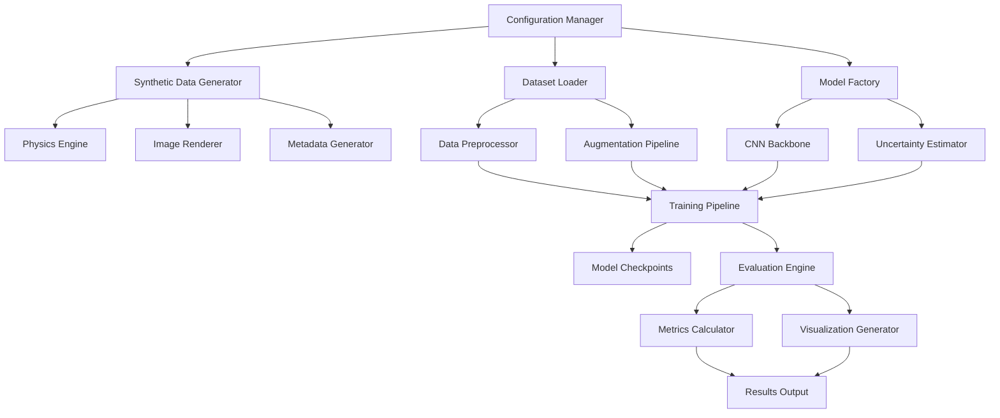

# Design Document

## Overview

The Physics-Informed Sonar Object Detection system is designed as a modular machine learning pipeline that combines synthetic data generation with deep learning for mine vs rock classification in sonar imagery. The system leverages physics-based approximations to generate training data and employs uncertainty quantification to provide confidence estimates for predictions.

## Architecture



The system follows a layered architecture with clear separation of concerns:

1. **Configuration Layer**: Manages all system parameters and settings
2. **Data Layer**: Handles synthetic generation and real data loading
3. **Model Layer**: Implements CNN architectures and uncertainty estimation
4. **Training Layer**: Orchestrates the three-phase training process
5. **Evaluation Layer**: Computes metrics and generates visualizations

## Components and Interfaces

### 1. Configuration Manager

**Purpose**: Centralized configuration management for all system parameters

**Interface**:
```python
class Config:
    # Data generation parameters
    image_size: Tuple[int, int] = (512, 512)
    synthetic_dataset_size: int = 10000
    physics_params: Dict[str, float]
    
    # Model parameters
    model_type: str = "unet"  # "unet", "resnet18", "efficientnet-b0"
    dropout_rate: float = 0.1
    mc_samples: int = 20
    
    # Training parameters
    batch_size: int = 16
    learning_rates: Dict[str, float]  # phase-specific
    epochs: Dict[str, int]  # phase-specific
    
    # Paths and outputs
    data_dir: Path
    output_dir: Path
    checkpoint_dir: Path
```

### 2. Synthetic Data Generator

**Purpose**: Generate physics-informed synthetic sonar images

**Components**:
- **Physics Engine**: Implements acoustic scattering approximations
- **Image Renderer**: Creates 2D sonar images from physics calculations
- **Metadata Generator**: Produces accompanying physics metadata

**Interface**:
```python
class SyntheticDataGenerator:
    def __init__(self, config: Config)
    
    def generate_dataset(self, num_samples: int) -> Tuple[np.ndarray, np.ndarray, List[Dict]]
    def generate_single_image(self, params: Dict) -> Tuple[np.ndarray, int, Dict]
    def apply_physics_effects(self, base_image: np.ndarray, params: Dict) -> np.ndarray
```

**Physics Implementation**:
- Backscatter intensity: `I = I₀ * cos^n(θ)` where θ is grazing angle
- Acoustic shadows: Geometric ray-tracing approximation
- Range attenuation: `I_attenuated = I / (R²)` 
- Speckle noise: Multiplicative Rayleigh/Gamma noise model
- Seabed texture: Procedural noise generation

### 3. Dataset Loader

**Purpose**: Load and preprocess both synthetic and real sonar datasets

**Interface**:
```python
class DatasetLoader:
    def __init__(self, config: Config)
    
    def load_synthetic_data(self) -> Dataset
    def load_real_data(self, dataset_name: str) -> Dataset
    def create_train_val_test_split(self, dataset: Dataset) -> Tuple[Dataset, Dataset, Dataset]
    def get_dataloader(self, dataset: Dataset, phase: str) -> DataLoader
```

**Data Pipeline**:
1. Image normalization to [0, 1] range
2. Augmentation (rotation, flip, noise injection)
3. Metadata encoding for auxiliary inputs
4. Batch preparation with proper tensor formatting

### 4. Model Factory

**Purpose**: Create and configure CNN models with uncertainty estimation

**Supported Architectures**:
- **U-Net**: For segmentation tasks with skip connections
- **ResNet18**: For classification with residual blocks
- **EfficientNet-B0**: Lightweight architecture for resource constraints

**Interface**:
```python
class ModelFactory:
    @staticmethod
    def create_model(model_type: str, config: Config) -> nn.Module
    
class SonarDetectionModel(nn.Module):
    def __init__(self, backbone: str, num_classes: int, dropout_rate: float)
    def forward(self, x: torch.Tensor, metadata: Optional[torch.Tensor] = None) -> torch.Tensor
    def forward_with_uncertainty(self, x: torch.Tensor, num_samples: int) -> Tuple[torch.Tensor, torch.Tensor]
```

### 5. Uncertainty Estimator

**Purpose**: Implement Monte Carlo Dropout for uncertainty quantification

**Interface**:
```python
class UncertaintyEstimator:
    def __init__(self, model: nn.Module, num_samples: int = 20)
    
    def predict_with_uncertainty(self, x: torch.Tensor) -> Tuple[torch.Tensor, torch.Tensor]:
        # Returns (mean_prediction, uncertainty)
    
    def calibrate_uncertainty(self, dataloader: DataLoader) -> Dict[str, float]:
        # Returns calibration metrics
```

**Implementation Details**:
- Enable dropout during inference
- Perform multiple forward passes (≥20)
- Compute prediction mean and variance
- Generate uncertainty heatmaps for visualization

### 6. Training Pipeline

**Purpose**: Orchestrate the three-phase training process

**Interface**:
```python
class TrainingPipeline:
    def __init__(self, model: nn.Module, config: Config)
    
    def phase1_synthetic_pretraining(self, synthetic_loader: DataLoader) -> Dict[str, float]
    def phase2_real_data_finetuning(self, real_loader: DataLoader) -> Dict[str, float]
    def phase3_uncertainty_calibration(self, val_loader: DataLoader) -> Dict[str, float]
    
    def train_epoch(self, dataloader: DataLoader, phase: str) -> Dict[str, float]
    def validate(self, dataloader: DataLoader) -> Dict[str, float]
```

**Phase-Specific Logic**:
- **Phase 1**: Full model training, heavy augmentation, early stopping
- **Phase 2**: Frozen early layers, low learning rate, minimal augmentation
- **Phase 3**: Dropout enabled, uncertainty validation, calibration curve generation

### 7. Evaluation Engine

**Purpose**: Compute comprehensive evaluation metrics and generate visualizations

**Interface**:
```python
class EvaluationEngine:
    def __init__(self, model: nn.Module, uncertainty_estimator: UncertaintyEstimator)
    
    def evaluate_model(self, test_loader: DataLoader) -> Dict[str, float]
    def generate_visualizations(self, test_loader: DataLoader, output_dir: Path)
    def compare_approaches(self, results: List[Dict]) -> pd.DataFrame
```

**Metrics Computed**:
- Classification: Precision, Recall, F1-score, AUC-ROC
- Segmentation: IoU, Dice coefficient, pixel accuracy
- Detection: False alarms per image, detection rate
- Uncertainty: Calibration error, reliability diagrams

## Data Models

### Image Data Structure
```python
@dataclass
class SonarImage:
    image: np.ndarray  # (512, 512) grayscale
    label: Union[int, np.ndarray]  # classification or segmentation
    metadata: Dict[str, float]  # physics parameters
    source: str  # "synthetic" or dataset name
    id: str  # unique identifier
```

### Physics Metadata Schema
```python
@dataclass
class PhysicsMetadata:
    grazing_angle_deg: float  # 0-90 degrees
    seabed_roughness: float  # 0-1 normalized
    range_m: float  # distance in meters
    noise_level: float  # 0-1 normalized
    target_material: str  # "metal", "rock", "sand"
    frequency_khz: float  # sonar frequency
    beam_width_deg: float  # acoustic beam width
```

### Training Configuration
```python
@dataclass
class TrainingConfig:
    phase1_epochs: int = 100
    phase2_epochs: int = 50
    phase3_epochs: int = 20
    
    phase1_lr: float = 1e-3
    phase2_lr: float = 1e-5
    phase3_lr: float = 1e-6
    
    early_stopping_patience: int = 10
    checkpoint_frequency: int = 5
```

## Error Handling

### Data Generation Errors
- **Invalid Physics Parameters**: Validate parameter ranges and provide defaults
- **Image Generation Failures**: Retry with different random seeds, log failures
- **Memory Constraints**: Implement batch generation for large datasets

### Training Errors
- **Model Convergence Issues**: Implement learning rate scheduling and gradient clipping
- **Overfitting Detection**: Monitor validation metrics and implement early stopping
- **Hardware Limitations**: Automatic batch size reduction and mixed precision training

### Evaluation Errors
- **Missing Test Data**: Graceful degradation with available data subsets
- **Visualization Failures**: Continue evaluation without stopping for plot errors
- **Metric Calculation Errors**: Robust error handling with NaN/Inf detection

## Testing Strategy

### Unit Tests
- **Physics Engine**: Validate acoustic scattering calculations
- **Data Loaders**: Test data integrity and augmentation pipelines
- **Model Components**: Verify architecture correctness and output shapes
- **Uncertainty Estimation**: Test Monte Carlo sampling consistency

### Integration Tests
- **End-to-End Pipeline**: Complete training and evaluation workflow
- **Data Flow**: Verify data consistency across pipeline stages
- **Configuration Management**: Test parameter loading and validation

### Performance Tests
- **Synthetic Generation Speed**: Benchmark image generation rates
- **Training Efficiency**: Monitor memory usage and training time
- **Inference Speed**: Measure prediction latency for deployment readiness

### Validation Tests
- **Physics Approximation Accuracy**: Compare with analytical solutions where possible
- **Model Sanity Checks**: Verify learning on simple synthetic cases
- **Uncertainty Calibration**: Validate confidence score reliability

## Implementation Priorities

1. **Core Infrastructure**: Configuration management and basic data structures
2. **Synthetic Data Generation**: Physics engine and image rendering
3. **Model Architecture**: CNN implementation with uncertainty support
4. **Training Pipeline**: Three-phase training orchestration
5. **Evaluation Framework**: Metrics calculation and visualization
6. **Integration and Testing**: End-to-end validation and performance optimization

This design provides a solid foundation for implementing the physics-informed sonar detection system while maintaining modularity, testability, and extensibility.